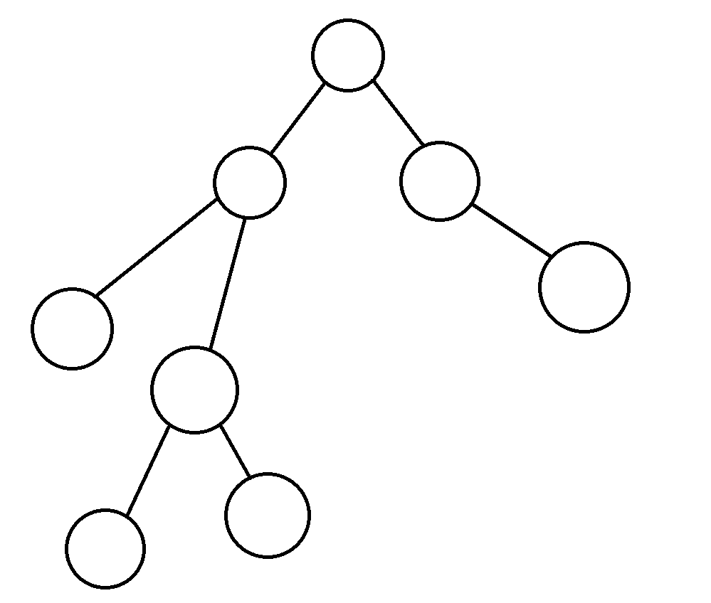

# BFS

## BFS란?

그림판 페인트 기능 중 특정 영역의 색을 전부 바꿔버리는 기능이 존재한다.

이 페인트 기능은 클릭한 칸의 상하좌우를 계속 비교해나가면서 클릭한 칸과 색이 같은지 확인하는 작업을 계속 반복하면서 클릭한 칸과 붙어있고, 같은 색인지를 계속해서 찾아나가는 작업이다.

이 기능은 Flood Fill 기능이라고도 불리는데 해당 기능이 BFS를 이용한 예시라고 할 수 있다.

### 정의

BFS는 Breadth First Search의 줄임말로 다차원 배열에서 각 칸을 방문할 때 너비를 우선으로 방문하는 알고리즘이라고 한다. (너비 우선 탐색 이라고도 부른다)

BFS는 그래프라는 자료구조에서 모든 노드를 방문하기 위한 알고리즘이다.

수학 시간이나 통계를 위해 자주보는 그런 그래프가 아닌 여러 node들을 관리하는 자료구조를 그래프라고 부르기도 한다

### 동작원리

BFS를 사용할 때 queue를 같이 사용하는 경우가 많다.

1. 시작하는 칸들을 queue에 넣고 방문했다는 표시를 남긴다.
2. 큐에서 원소를 꺼내 그 주변의 칸들 (보통 상, 하, 좌, 우)에 대해 3번의 행동 진행
3. 해당 칸을 이전에 방문했다면 아무 작업도 진행하지 않고, 처음으로 방문했다면 방문했다는 표시를 남기고 queue에 칸을 삽입
4. queue가 빌 때 까지 동작 반복

모든 칸이 Queue에 한번씩 들어가므로 시간복잡도는 칸이 N개일 때 O(N)만큼 소요된다.

참고로 BFS로 문제를 풀 때(주로 좌표를 이용할 때) pair를 이용하는 경우도 종종 있으니 참고해보면 좋을 것 같다.

[참고링크](https://github.com/goldfrosch/algorithm-solve/blob/main/%40%EC%9D%B4%EB%A1%A0/1.%20%EC%BD%94%EB%93%9C%20%EC%9E%91%EC%84%B1%20%EC%9A%94%EB%A0%B9/C%2B%2B%ED%8C%81.md#pair)
